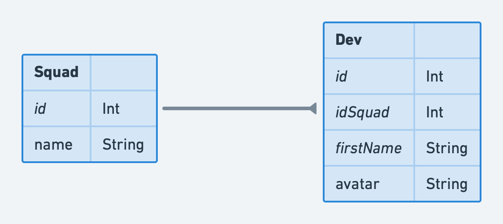

# Devfriends workshop backend

Backend for [Devfriends workshop](https://github.com/jpb06/dev-friends-workshop) repo.

<!-- readme-package-icons start -->

&nbsp;&nbsp;&nbsp;&nbsp;&nbsp;&nbsp;&nbsp;&nbsp;&nbsp;&nbsp;&nbsp;&nbsp;&nbsp;&nbsp;

<!-- readme-package-icons end -->

## ⚡ Data model

## ⚡ Routes exposed

Here is a quick summary. You can get more details from the [api swagger](https://devfriends-backend.fly.dev).

| Route                 | Verb    | Description                                                             |
| --------------------- | ------- | ----------------------------------------------------------------------- |
| 💥 /squads            | 🔹 GET  | Retrieves all squads                                                    |
| 💥 /squads/{id}/devs  | 🔹 GET  | Retrieves all devs belonging to a squad                                 |
| 💥 /devs              | 🔹 GET  | Retrieves all devs                                                      |
| 💥 /devs/by-squad     | 🔸 POST | Retrieves devs belonging to a list of squads passed in the request body |
| 💥 /devs/change-squad | 🔸 POST | Moves a developer to another squad                                      |
